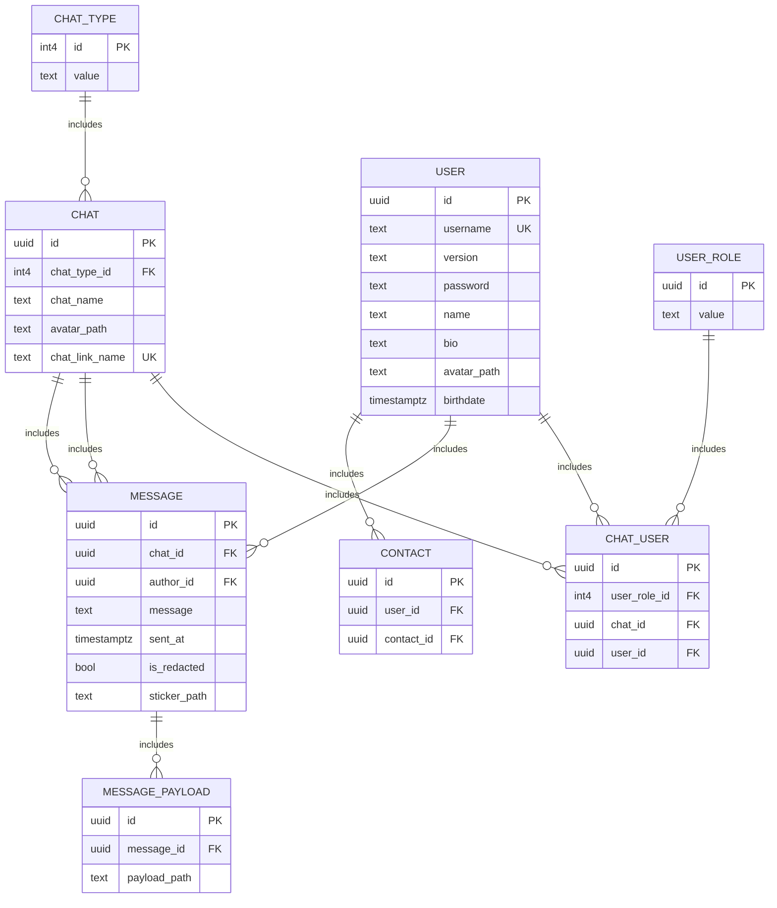

Таблица user
---
Хранит информацию о пользователях сервиса\
`{id} -> username, name, bio, avatar_path, birthdate, version`\
`{username} -> id, name, bio, avatar_path, birthdate, version`
- 1НФ - не используются составные типы данных.
- 2НФ - все неключевые атрибуты неприводимо зависят от первичного ключа id.
- 3НФ - все неключевые атрибуты нетранзитивно зависят от первичного ключа, нет транзитивных зависимостей.
- НФБК - каждая нетривиальная и неприводимая слева функциональная зависимость обладает потенциальным ключом в качестве детерминанта. - В данном случае потенциальный первичный ключ один, поэтому отношение соответствует НФБК, т. к. оно находится в 3НФ.

Таблица chat
---
Хранит информацию о чатах\
`{id} -> chat_name, chat_type_id, avatar_path, chat_link_name`\
`{chat_link_name} -> id, chat_name, chat_type_id, avatar_path`
- 1НФ - не используются составные типы данных.
- 2НФ - все неключевые атрибуты неприводимо зависят от первичного ключа id.
- 3НФ - все неключевые атрибуты нетранзитивно зависят от первичного ключа, нет транзитивных зависимостей.
- НФБК - каждая нетривиальная и неприводимая слева функциональная зависимость обладает потенциальным ключом в качестве детерминанта В данном случае потенциальный первичный ключ один, поэтому отношение соответствует НФБК, т. к. оно находится в 3НФ.

Таблица contact
---
Хранит информацию о контактах пользователей\
`{id} -> user_id, contact_id`\
`{user_id, contact_id} -> id`
- В данном отношении потенциальным ключом являются атрибуты {user_id, contact_id}, они также являются единственными атрибутами и не зависят друг от друга, поэтому ФЗ нет и отношение соответсвует 1НФ, 2НФ, 3НФ, НФБК.

Таблица chat
---
Хранит информацию о чатах\
`{id} -> chat_name, chat_type_id, avatar_path, chat_link_name`\
`{chat_link_name} -> id, chat_name, chat_type_id, avatar_path`
- 1НФ - не используются составные типы данных.
- 2НФ - все неключевые атрибуты неприводимо зависят от первичного ключа id.
- 3НФ - все неключевые атрибуты нетранзитивно зависят от первичного ключа, нет транзитивных зависимостей.
- НФБК - каждая нетривиальная и неприводимая слева функциональная зависимость обладает потенциальным ключом в качестве детерминанта В данном случае потенциальный первичный ключ один, поэтому отношение соответствует НФБК, т. к. оно находится в 3НФ.

Таблица chat_type
---
Хранит информацию о видах чатов (личные сообщения, группа, канал)\
`{id} -> value`
- В данном отношении атрибут value единственный и зависит от id, поэтому ФЗ нет и отношение соотвествует 1НФ, 2НФ, 3НФ, НФБК.

Таблица chat
---
Хранит информацию о чатах\
`{id} -> chat_name, chat_type_id, avatar_path, chat_link_name`\
`{chat_link_name} -> id, chat_name, chat_type_id, avatar_path`
- 1НФ - не используются составные типы данных.
- 2НФ - все неключевые атрибуты неприводимо зависят от первичного ключа id.
- 3НФ - все неключевые атрибуты нетранзитивно зависят от первичного ключа, нет транзитивных зависимостей.
- НФБК - каждая нетривиальная и неприводимая слева функциональная зависимость обладает потенциальным ключом в качестве детерминанта В данном случае потенциальный первичный ключ один, поэтому отношение соответствует НФБК, т. к. оно находится в 3НФ.

Таблица user_role
---
Хранит информацию о ролях пользователей в чатах\
`{id} -> value`
- В данном отношении атрибут value единственный и зависит от id, поэтому ФЗ нет и отношение соотвествует 1НФ, 2НФ, 3НФ, НФБК.

Таблица chat_user
---
Хранит информацию об участников чатов\
`{id} -> chat_id, user_role_id, user_id`\
`{chat_id, user_id} -> id, user_role_id`
- 1НФ - не используются составные типы данных.
- 2НФ - все неключевые атрибуты неприводимо зависят от первичного ключа id.
- 3НФ - все неключевые атрибуты нетранзитивно зависят от первичного ключа, нет транзитивных зависимостей.
- НФБК - каждая нетривиальная и неприводимая слева функциональная зависимость обладает потенциальным ключом в качестве детерминанта В данном случае потенциальный первичный ключ один, поэтому отношение соответствует НФБК, т. к. оно находится в 3НФ.

Таблица message_payload
---
Хранит информацию о вложениях сообщений\
`{id} -> message_id, payload_path`
- 1НФ - не используются составные типы данных.
- 2НФ - все неключевые атрибуты неприводимо зависят от первичного ключа id.
- 3НФ - все неключевые атрибуты нетранзитивно зависят от первичного ключа, нет транзитивных зависимостей.
- НФБК - каждая нетривиальная и неприводимая слева функциональная зависимость обладает потенциальным ключом в качестве детерминанта В данном случае потенциальный первичный ключ один, поэтому отношение соответствует НФБК, т. к. оно находится в 3НФ.

## Диаграмма

